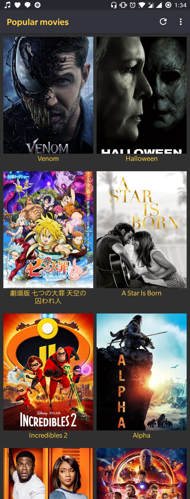

# PopularMovies App
Android app that displays a list movies and their details.

## Project Overview
Users can view most popular and top rated movies alongside details like release year, rating, trailers, and reviews. Users can also favorite movies they like. Favorite movies are stored in a local database. 
All movie data is fetched from themoviedb.org API. 

## Getting Started
You will need an API key from themoviedb.org to request data. If you don’t already have an account, you will need to [create one](https://www.google.com/url?q=https://www.themoviedb.org/account/signup&sa=D&ust=1533333489625000) in order to
                                                                           request an API Key.
Use your API key as the value for API_KEY in the file Apiconstants.java class

## Features
*   Discover the most popular and the most rated movies
*   Add favorite movies to database
*   MVVM with Android Architecture Components
*   Coordinator layout
*   Material design.

## Prerequisites
*   Android Studio IDE 3.0+
*   Android SDK v28
*   Android Build Tools v28.0.3
*   Gradle 4.6
*   Generate an api key from themoviedb.org website 

## Libraries
*   [Retrofit 2] (https://github.com/square/retrofit) - Type-safe HTTP client for Android and Java by Square, Inc. 
*   [Gson] (https://github.com/google/gson) - A Java serialization/deserialization library to convert Java Objects into JSON and back
*   [LiveData] (https://developer.android.com/topic/libraries/architecture/livedata)
*   [ViewModel] (https://developer.android.com/topic/libraries/architecture/viewmodel)
*   [Room] (https://developer.android.com/topic/libraries/architecture/room)
*   [Picasso] (https://github.com/square/picasso)
*   [LikeButton] (https://github.com/jd-alexander/LikeButton)

## License
This project is licensed under the Apache License 2.0 - See: http://www.apache.org/licenses/LICENSE-2.0.txt

## Screenshot
 
